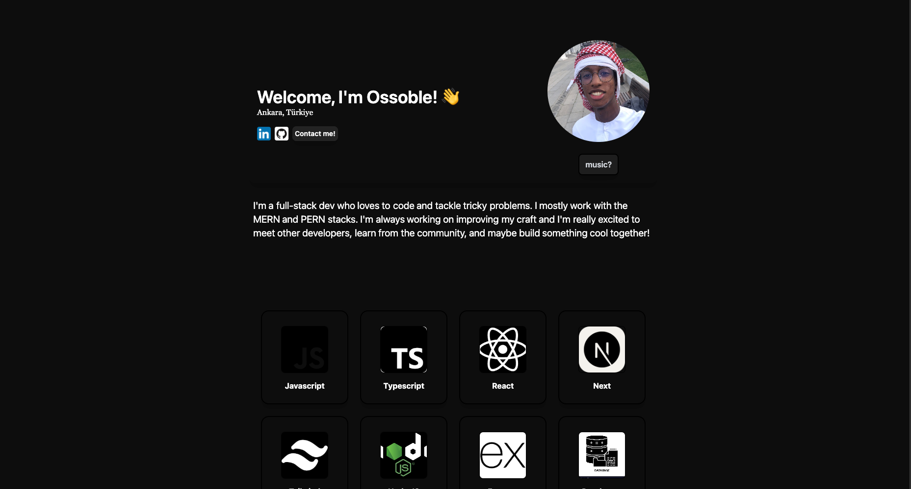

# Welcome to my Portfolio!

About me:

I code for the love of the game and making things that are cool! This Portfolio will be a way ofme showcasing my skills to the world.
For this project, I used React and Tailwindcss with a little bit of animations. I plan to finish it fully when i have atleast 2 well-documented projects under my belt.

Ofcourse it was also a learning project trying to improve my UI/Ux skills. In this project i used react with plain Javascript, tailwind for styling and a little bit of framer-motion/motion. All code was written by me (except some of the skills component). If you would like to collaborate on upcoming projects please feel free to contact me!

Even tho its a bit basic and incomplete i went through multiple versions of this to finally get to this final version where i will just be adding to this in the near future. (when im done with the projects to showcase here)

Anyways this is me in my current level and i will probably make a better one when im at a stage where i can say i got better!

Live Preview -- 

Live Link: portfolio-git-main-ossobles-projects.vercel.app